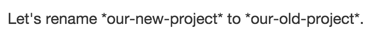

# comment and backslash escapes

## Hiding content with comments

We can hide content from the rendered Markdown by placing the content in an HTML comment.

```markdown
<!-- This content will not appear in the rendered Markdown -->
```


## Ignoring Markdown formatting

We can ignore (or escape) Markdown formatting by using `\` before the Markdown character.

```markdown
Let's rename \*our-new-project\* to \*our-old-project\*.
```



For more information, see Daring Fireball's "[backslash escapes - Markdown Syntax](https://daringfireball.net/projects/markdown/syntax#backslash)."

## References

- [hiding-content-with-comments - Markdown - GitHub Docs](https://docs.github.com/en/github/writing-on-github/getting-started-with-writing-and-formatting-on-github/basic-writing-and-formatting-syntax#hiding-content-with-comments)
- [ignoring-markdown-formatting - Markdown - GitHub Docs](https://docs.github.com/en/github/writing-on-github/getting-started-with-writing-and-formatting-on-github/basic-writing-and-formatting-syntax#ignoring-markdown-formatting)

